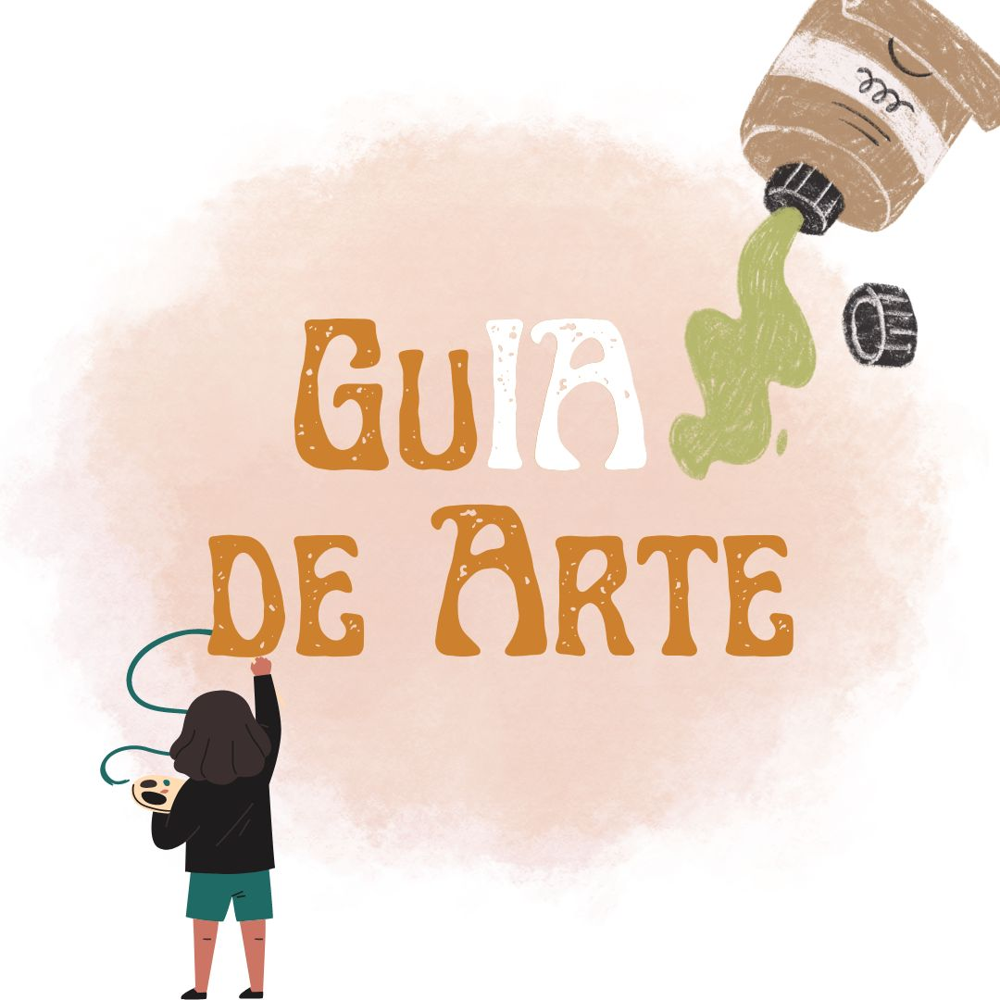

# GuIA de Arte
Um chatbot que analisa imagens de obras de arte e fornece informações sobre o artista, nome da obra e movimento artístico.

GuIA de Arte é um assistente virtual dedicado a desvendar o mundo da arte. Com sua capacidade única de análise de imagem, ele transforma qualquer imagem de uma obra de arte em uma experiência educativa e informativa. Seja você um entusiasta da arte ou apenas alguém curioso, este chatbot está aqui para enriquecer sua compreensão e apreciação pela arte.

### **Funcionalidades:**

* Análise de Imagem: Basta enviar uma imagem da obra de arte que você deseja aprender mais e o GuIA de Arte vai analisá-la.
* Informações Detalhadas: Receba informações detalhadas sobre a obra, incluindo o nome do artista, título da obra e movimento artístico ao qual ela pertence.
* Contextualização Histórica: Além das informações básicas, o GuIA de Arte também fornece uma breve contextualização histórica sobre a obra e o artista, ajudando a entender o significado e a importância cultural.

### **Como utilizar:**

* Digite no prompt o nome do arquivo da imagem desejada, que está salva dentro da pasta 'content'.
* Caso queira analisar mais imagens, basta salvar o arquivo dentro da pasta 'content'.
* Para finalizar, digite 'fim'.
